# 4.6
##continue trainig last week’s model

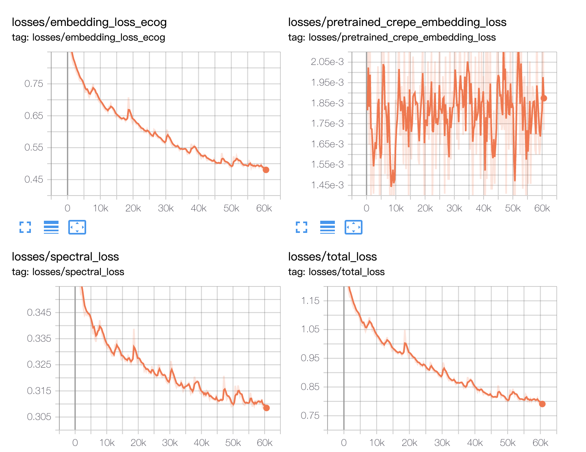

the loss decreases slowly, 60k iterations are enough for training DDSP autoencoder using SHTOOKA dataset.

---
correlation and stoi:

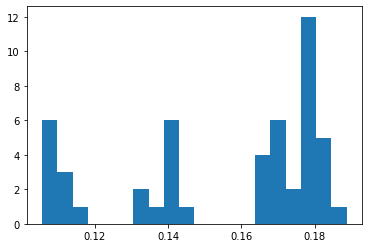

---
## latent feature extracted using DDSP ECoG encoder

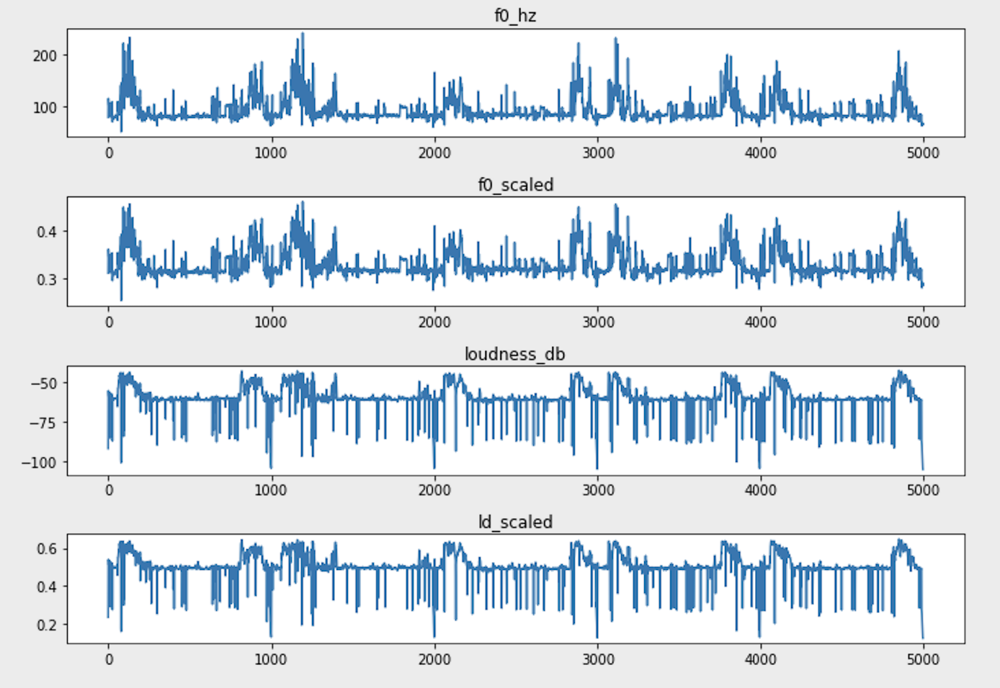

---

## check again DDSP autoencoder’s restore operation

previously, the autoencoder has some problem to restore the weights, so modify some codes and change to the latest DDSP version, retrain two autoencoders (with z or without z)
the results are correct now

https://drive.google.com/open?id=1vDq2Qi-ArOvI7ahPBCB3oetGLoxViAwy
https://drive.google.com/open?id=11M0PU_5c5MlLDeVj7C8QzW0jfUgNJEda 

---
## add simple RNN to f0 and loudness encoding

and add similar strategy to loudness encoder did not improve the result (make it a little worse)
(1000,2,2,128)->reduce mean:(1000,128) ->GRU->(1000,256)->softplus and sum:(1000,1)

the author said that a simple RNN might be useful to f0 and loudness encoding *(You can also train small autoregressive models like a simple RNN, since the signal is much simpler than an audio waveform. )*
I tested it but did not work well. (**Might need more training**)

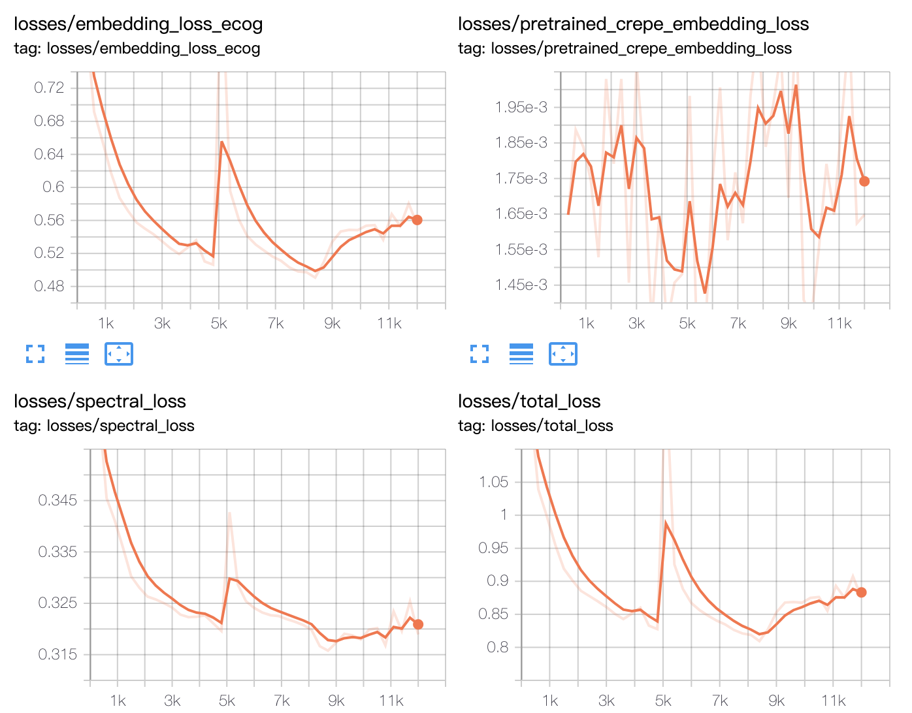

---

correlation and stoi:

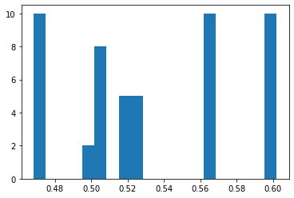

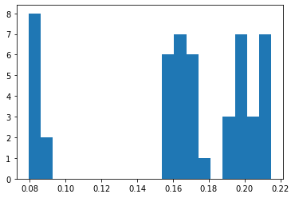

---
## latent feature extracted using DDSP ECoG encoder

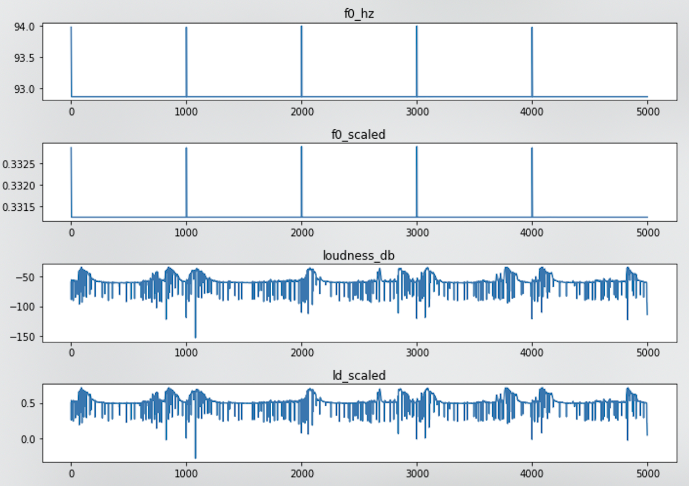

f0 feature is weird, it seems that RNN suppresses nearly all signals.

---

## allow multi gpu training
add multi gpu training codes to speed up the training a little bit (not very useful, maybe gradient transfer between different gpu is also time consuming)

---

## mask out reproduction period signal

original ECoG signal

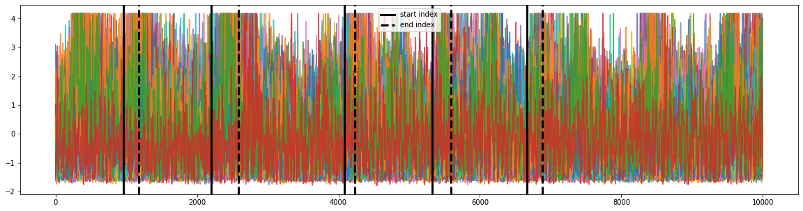

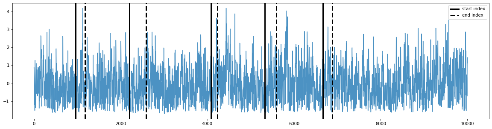
---

## set signals outside perception region to be zero

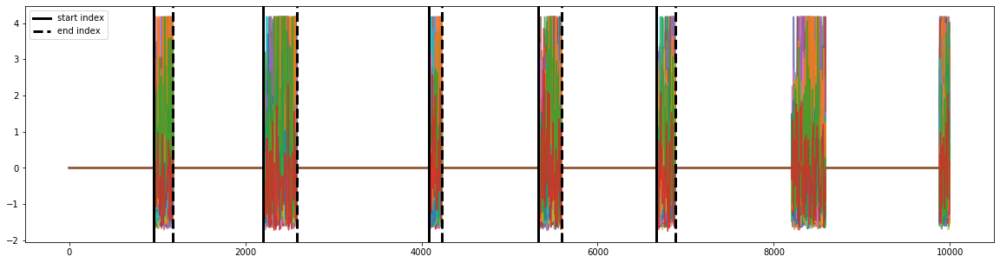

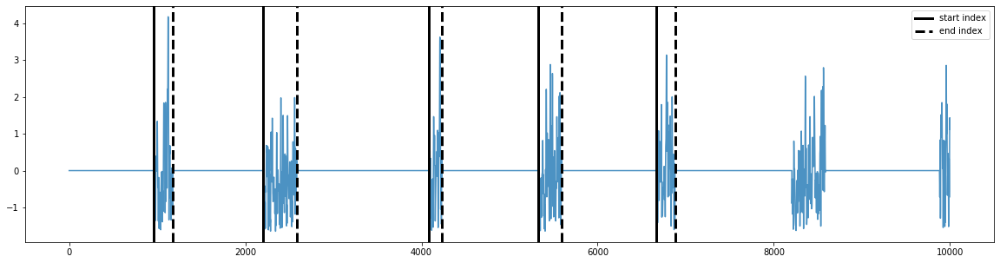

maybe we should make it smoother at boundary?

---

## one sample example

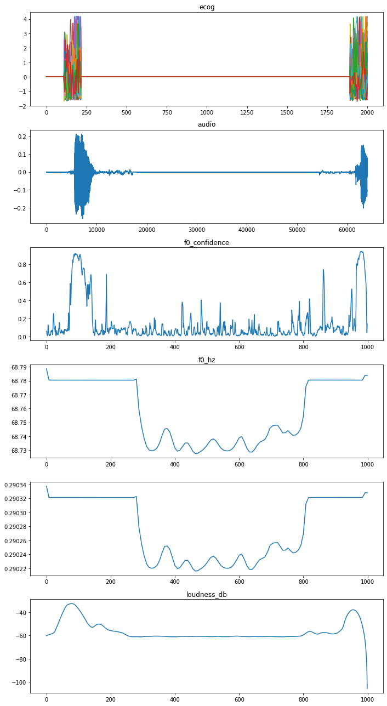

---

## performance

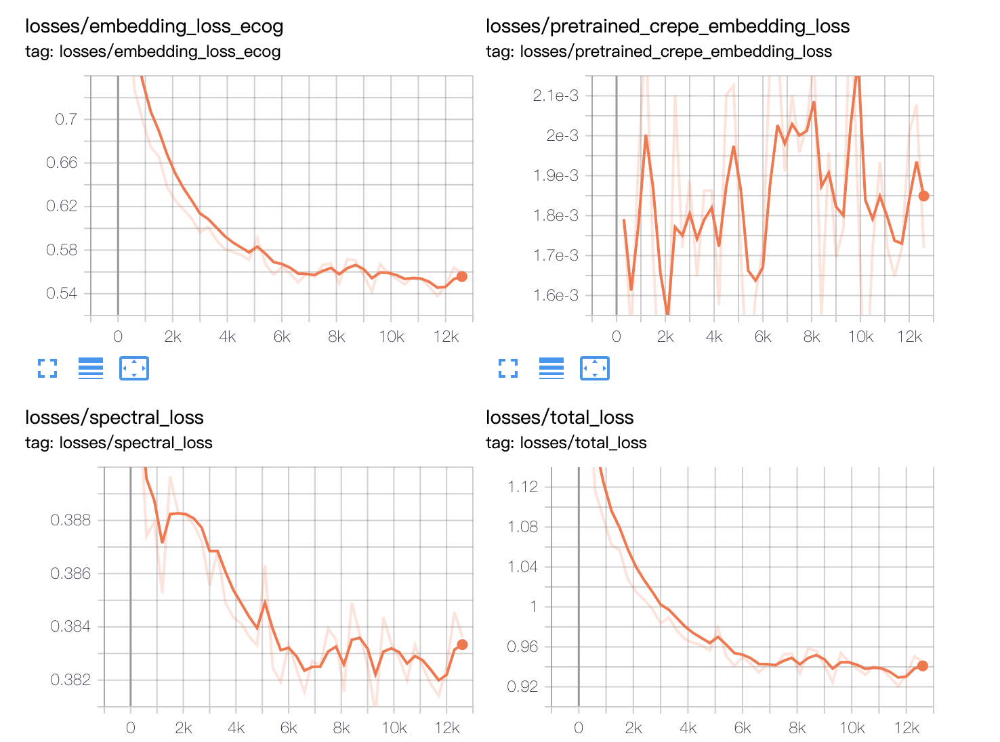

(need more training? 
Training is slow, one day only 10,000 steps. Just fix entire model restore problem)

---

## mask out data training
(not use z latent, not use RNN in encoder)
- correlation is very poor

- reconstructed audio is weird

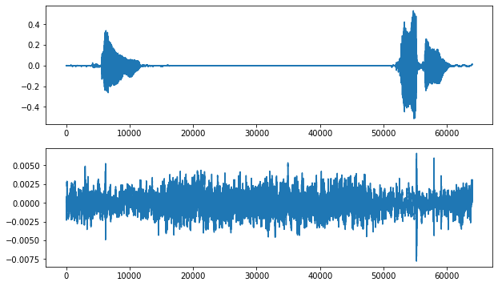  

---
<audio controls>
<source src="audio/gt.wav" type="audio/wav">
</audio>  

<audio controls>
<source src="audio/z_0_rnn_0.wav" 
type="audio/wav">
</audio>

---
## extracting latent feature from new ecog data using trained DDSP ecog autoencoder
 
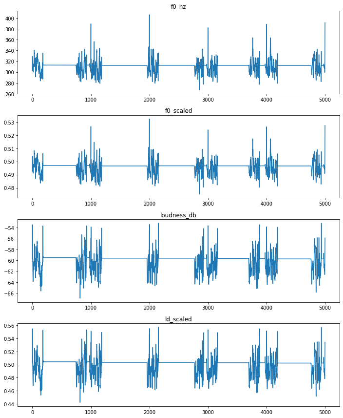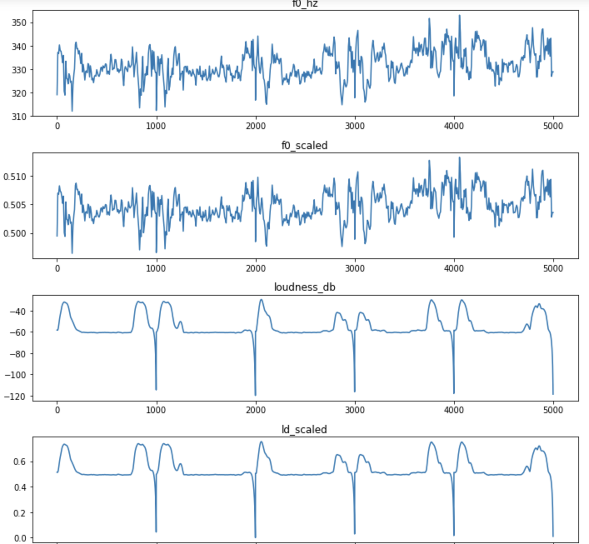

- features from ecog encoder have some problems: loudness seems ok, but f0 might need more variation in silent period.
 

 
---
## other experiments using mask out data
- Similar bad results:
    - use z, not use RNN in encoder
    - use z, use RNN in encoder
- better result:
    - not use z, use RNN in encoder
(but the audio does not make sense, and it is not better than original ECoG data, not use z, not use RNN experiment)

<audio controls>
<source src="audio/gt.wav" type="audio/wav">
</audio>  

<audio controls>
<source src="audio/z_0_rnn_1.wav" 
type="audio/wav">
</audio>       
 
---
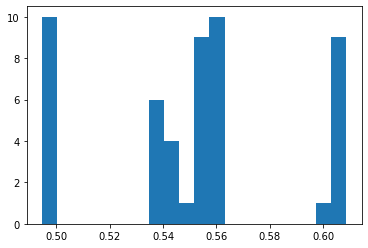

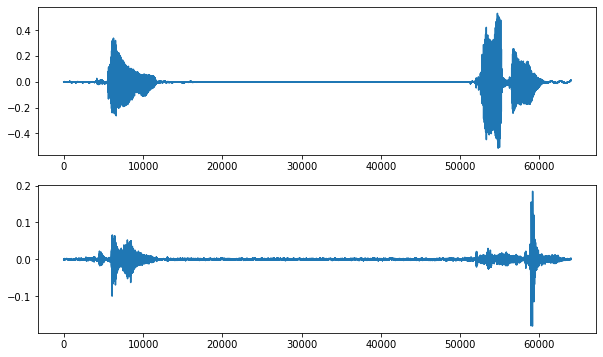

---
## extracted features comparison
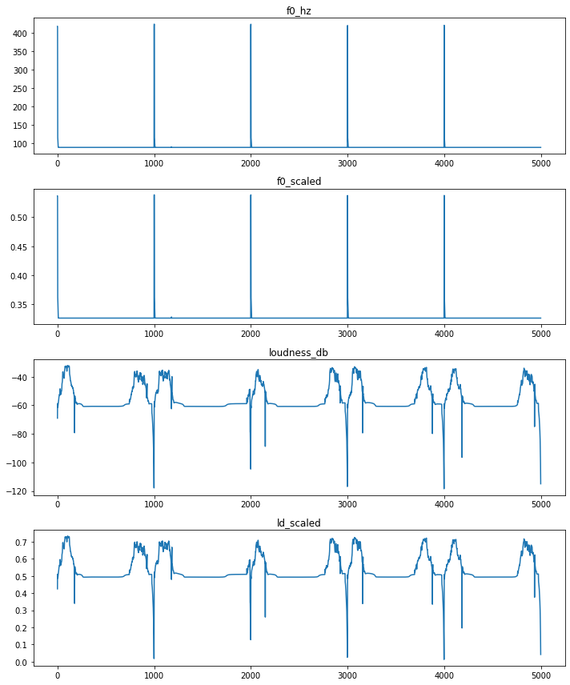

- It seems the RNN encoder suppresses nearly all signals.
- But loudness features extraction seems really **good** if we use RNN encoder on mask out data.
- F0 features need more variance.

---
 
## TODO
- [ ] more training epochs for mask out data and RNN encoder
    - [ ] resume training using both encoder and decoder(still have to manually assign weights)
- [ ] other mask out strategy?
- [ ] analyze CREPEPRETRAINED embedding loss, why is it always 0
- [ ] how to better encode f0

---
## use z, add rnn, mask out

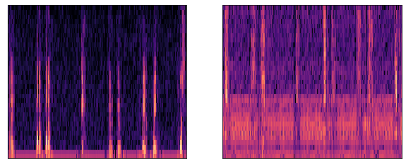    

<audio controls>
<source src="audio/gt.wav" type="audio/wav">
</audio>  

<audio controls>
<source src="audio/z_1_rnn_1.wav" 
type="audio/wav">
</audio>   
 
---
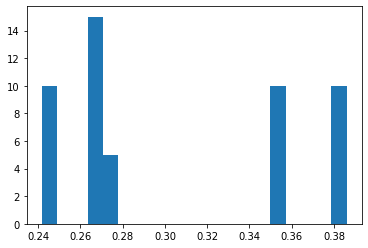

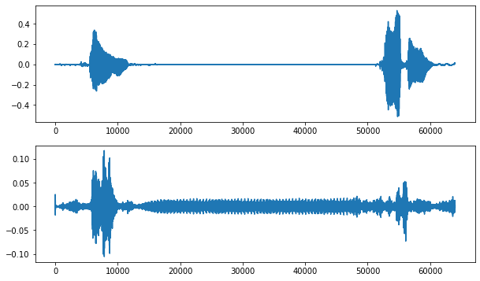

---
## extracted features comparison
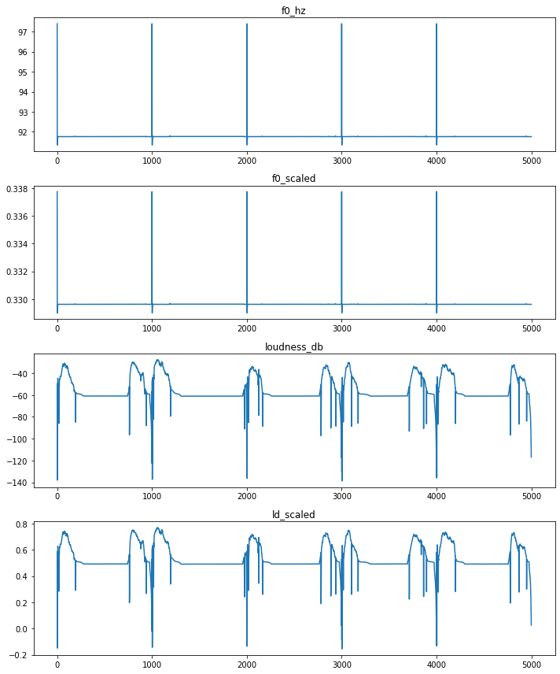
---
## use z, not use rnn, mask out

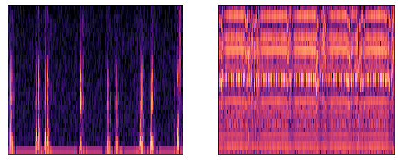   

<audio controls>
<source src="audio/gt.wav" type="audio/wav">
</audio>  

<audio controls>
<source src="audio/z_1_rnn_0.wav" 
type="audio/wav">
</audio>    
 
---
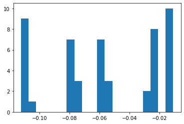

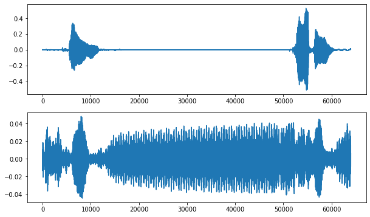

---
## extracted features comparison
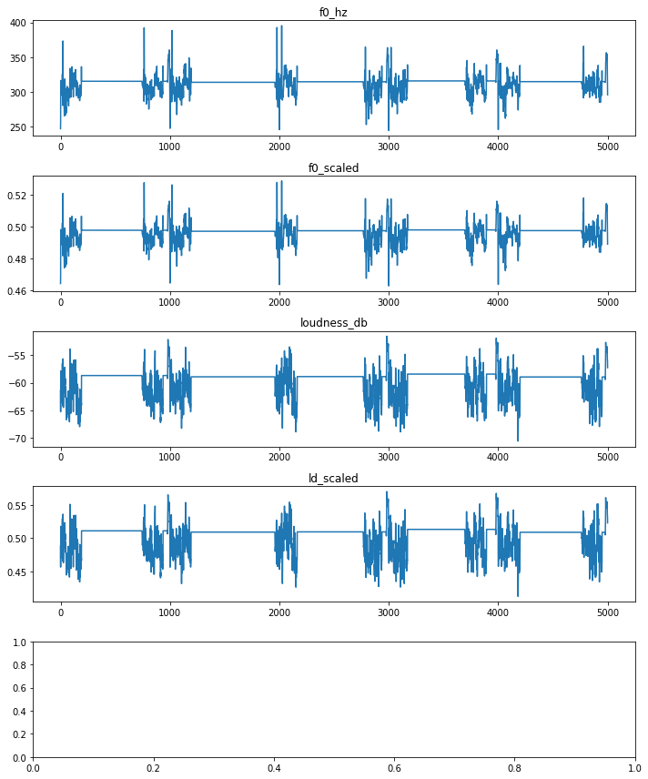

